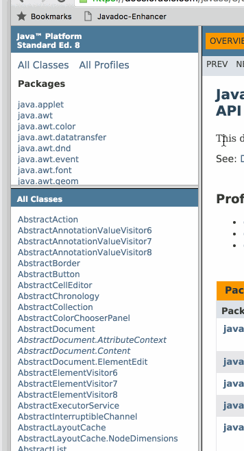

# Javadoc-Enhancer
Javadoc-Enhander adds a convenient search-field to the class list of Javadoc page. The search field mimics the camel-case notation known from tools such as Intellij Idea and Eclipse, and allows the use of wildcards.

Go to the [demo page](http://bitcraft.dk/Javadoc-Enhancer/ "demopage") to see it in action.

# Installation

The search-field is inserted using a bookmarklet. Github doesn't allow javascript-links, so installation is done in one of the following ways:
* Go to the [demo page](http://bitcraft.dk/Javadoc-Enhancer/) and bookmark the link given in the ´*Installation* section.
* Copy the following url into an existing bookmark

    `javascript:(function(){function a(a,e){var n=document.createElement("script");n.src=a,n.onload=e,document.getElementsByTagName("head")[0].appendChild(n)}a("//ajax.googleapis.com/ajax/libs/jquery/2.1.4/jquery.min.js",function(){a("//cdn.rawgit.com/haasted/Javadoc-Enhancer/e9a0e7f8f165b2f26c4dddb6efa3d1849c666ba8/jdocenhance.min.js")})})()`

# Behind the scenes

The bookmarklet works by loading the script `jdocenhance.min.js` through the [rawgit.com](http://rawgit.com/) CDN.

# Future work

The following items are on the roadmap for future versions

* Automatically re-insert the script if the "All classes" frame changes.
* Keyboard navigation
* Look into creating a Greasemonkey script that automates the insertion.
* Make the bookmarklet load the latest release, rather than being locked into a specific version.
* Map out the differences in Javadoc through the ages to support older versions.